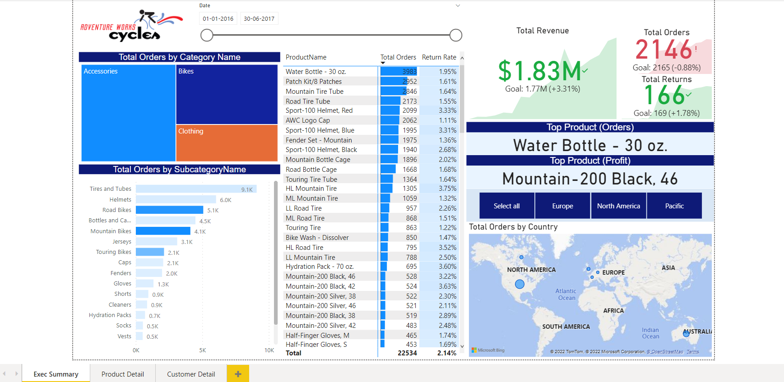
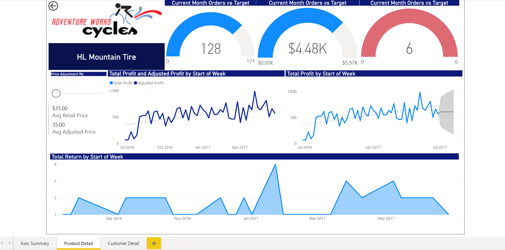
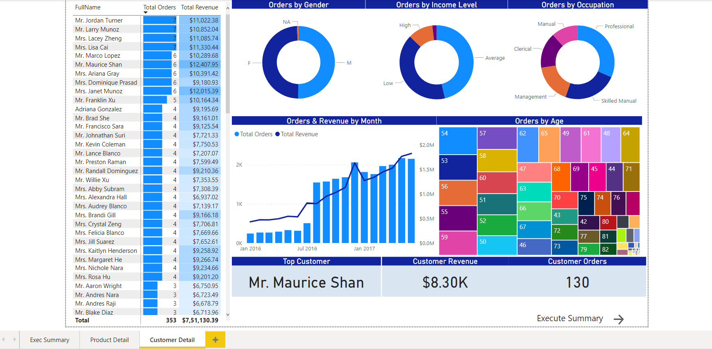
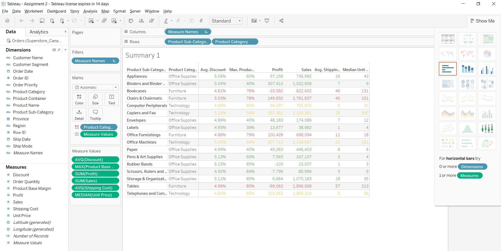

# Power-BI

# Tableau

New chat

vijayasarathi2@gmail.com
Using docker to test airflow dags in local environment 

Docker can be a useful tool for testing Airflow DAGs in a local environment because it allows you to create a self-contained environment that includes all the necessary dependencies and configurations for running Airflow.

Here are the general steps to use Docker to test Airflow DAGs in a local environment:

Install Docker: First, you'll need to install Docker on your local machine. You can download it from the official Docker website.

Create a Dockerfile: A Dockerfile is a script that defines the instructions to build a Docker image. You can create a Dockerfile that includes all the necessary dependencies and configurations for running Airflow. Here's an example of what a Dockerfile for Airflow might look like:

sql
Copy code
FROM python:3.7-slim-buster

RUN apt-get update && \
    apt-get install -yqq --no-install-recommends \
        build-essential \
        libssl-dev \
        libffi-dev \
        python3-dev \
        git \
        && apt-get clean

RUN pip install --upgrade pip && \
    pip install 'apache-airflow[postgres,celery]' && \
    pip install psycopg2-binary

ENV AIRFLOW_HOME=/usr/local/airflow
RUN airflow db init && \
    airflow users create --username admin --password admin --firstname Admin --lastname User --role Admin --email admin@example.com

EXPOSE 8080

CMD ["airflow", "webserver", "--port", "8080"]
This Dockerfile installs the necessary dependencies for Airflow, creates an Airflow user, initializes the Airflow database, and sets the command to start the Airflow webserver on port 8080.

Build the Docker image: Once you have created the Dockerfile, you can use it to build a Docker image that contains Airflow and all the necessary dependencies. To do this, navigate to the directory containing the Dockerfile and run the following command:
perl
Copy code
docker build -t my-airflow-image .
This command will build a Docker image with the tag my-airflow-image.

Start a Docker container: After building the Docker image, you can start a Docker container based on that image. To do this, run the following command:
css
Copy code
docker run -p 8080:8080 my-airflow-image
This command starts a Docker container based on the my-airflow-image image and maps port 8080 in the container to port 8080 on the host machine.

Access the Airflow UI: After starting the Docker container, you can access the Airflow UI by navigating to localhost:8080 in your web browser.

Test your DAGs: You can now test your Airflow DAGs in the Docker container. You can copy your DAG files into the container by mounting a volume, or you can use a tool like Git to clone your DAG repository into the container.

That's it! Using Docker to test Airflow DAGs in a local environment can help you ensure that your DAGs are working correctly before deploying them to a production environment.

2 / 2

vijayasarathi2@gmail.com
Using Google composer airflow to test the dags in the local environment and get the errors list

Google Cloud Composer provides a managed Airflow environment that you can use to test your DAGs. However, it is not designed for local testing. If you want to test your DAGs locally, you can follow the steps below:

Install and set up the Google Cloud SDK on your local machine.

Create a new Cloud Composer environment using the gcloud command-line tool:

css
Copy code
gcloud composer environments create [ENVIRONMENT_NAME] \
    --location [LOCATION] \
    --zone [ZONE] \
    --python-version 3 \
    --machine-type n1-standard-2 \
    --image-version composer-[AIRFLOW_VERSION]-airflow-[AIRFLOW_VERSION]
Replace [ENVIRONMENT_NAME] with a name for your environment, [LOCATION] with the region you want to use (e.g., us-central1), [ZONE] with a zone in that region (e.g., us-central1-a), [AIRFLOW_VERSION] with the version of Airflow you want to use (e.g., 2.2.0).

Configure your local environment to authenticate with Google Cloud:
bash
Copy code
gcloud auth login
gcloud config set project [PROJECT_ID]
gcloud config set composer/environment [ENVIRONMENT_NAME]
Replace [PROJECT_ID] with the ID of your Google Cloud project.

Copy your DAG files to the Cloud Storage bucket associated with your Composer environment:
bash
Copy code
gsutil cp [LOCAL_FILE_PATH] gs://[BUCKET_NAME]/dags/[DAG_FILE_NAME]
Replace [LOCAL_FILE_PATH] with the path to your DAG file on your local machine, [BUCKET_NAME] with the name of the Cloud Storage bucket associated with your Composer environment, and [DAG_FILE_NAME] with the name of your DAG file.

Trigger your DAG in Cloud Composer using the gcloud command-line tool:
css
Copy code
gcloud composer environments run [ENVIRONMENT_NAME] \
    --location [LOCATION] \
    trigger_dag \
    -- [DAG_ID] \
    --conf '{"key": "value"}'
Replace [DAG_ID] with the ID of your DAG and ["key": "value"] with any configuration values you want to pass to your DAG.

Monitor the progress of your DAG in the Airflow UI in the Cloud Composer environment.
To see the errors list, you can go to the Airflow UI in the Cloud Composer environment and view the logs for your DAG run. The logs will show any errors that occurred during the DAG run. You can also set up email alerts to receive notifications when a DAG run fails.

Docker can be a useful tool for testing Airflow DAGs in a local environment because it allows you to create a self-contained environment that includes all the necessary dependencies and configurations for running Airflow.

Here are the general steps to use Docker to test Airflow DAGs in a local environment:

Install Docker: First, you'll need to install Docker on your local machine. You can download it from the official Docker website.

Create a Dockerfile: A Dockerfile is a script that defines the instructions to build a Docker image. You can create a Dockerfile that includes all the necessary dependencies and configurations for running Airflow. Here's an example of what a Dockerfile for Airflow might look like:

sql
Copy code
FROM python:3.7-slim-buster

RUN apt-get update && \
    apt-get install -yqq --no-install-recommends \
        build-essential \
        libssl-dev \
        libffi-dev \
        python3-dev \
        git \
        && apt-get clean

RUN pip install --upgrade pip && \
    pip install 'apache-airflow[postgres,celery]' && \
    pip install psycopg2-binary

ENV AIRFLOW_HOME=/usr/local/airflow
RUN airflow db init && \
    airflow users create --username admin --password admin --firstname Admin --lastname User --role Admin --email admin@example.com

EXPOSE 8080

CMD ["airflow", "webserver", "--port", "8080"]
This Dockerfile installs the necessary dependencies for Airflow, creates an Airflow user, initializes the Airflow database, and sets the command to start the Airflow webserver on port 8080.

Build the Docker image: Once you have created the Dockerfile, you can use it to build a Docker image that contains Airflow and all the necessary dependencies. To do this, navigate to the directory containing the Dockerfile and run the following command:
perl
Copy code
docker build -t my-airflow-image .
This command will build a Docker image with the tag my-airflow-image.

Start a Docker container: After building the Docker image, you can start a Docker container based on that image. To do this, run the following command:
css
Copy code
docker run -p 8080:8080 my-airflow-image
This command starts a Docker container based on the my-airflow-image image and maps port 8080 in the container to port 8080 on the host machine.

Access the Airflow UI: After starting the Docker container, you can access the Airflow UI by navigating to localhost:8080 in your web browser.

Test your DAGs: You can now test your Airflow DAGs in the Docker container. You can copy your DAG files into the container by mounting a volume, or you can use a tool like Git to clone your DAG repository into the container.

That's it! Using Docker to test Airflow DAGs in a local environment can help you ensure that your DAGs are working correctly before deploying them to a production environment.

2 / 2

vijayasarathi2@gmail.com
Using Google composer airflow to test the dags in the local environment and get the errors list

Google Cloud Composer provides a managed Airflow environment that you can use to test your DAGs. However, it is not designed for local testing. If you want to test your DAGs locally, you can follow the steps below:

Install and set up the Google Cloud SDK on your local machine.

Create a new Cloud Composer environment using the gcloud command-line tool:

css
Copy code
gcloud composer environments create [ENVIRONMENT_NAME] \
    --location [LOCATION] \
    --zone [ZONE] \
    --python-version 3 \
    --machine-type n1-standard-2 \
    --image-version composer-[AIRFLOW_VERSION]-airflow-[AIRFLOW_VERSION]
Replace [ENVIRONMENT_NAME] with a name for your environment, [LOCATION] with the region you want to use (e.g., us-central1), [ZONE] with a zone in that region (e.g., us-central1-a), [AIRFLOW_VERSION] with the version of Airflow you want to use (e.g., 2.2.0).

Configure your local environment to authenticate with Google Cloud:
bash
Copy code
gcloud auth login
gcloud config set project [PROJECT_ID]
gcloud config set composer/environment [ENVIRONMENT_NAME]
Replace [PROJECT_ID] with the ID of your Google Cloud project.

Copy your DAG files to the Cloud Storage bucket associated with your Composer environment:
bash
Copy code
gsutil cp [LOCAL_FILE_PATH] gs://[BUCKET_NAME]/dags/[DAG_FILE_NAME]
Replace [LOCAL_FILE_PATH] with the path to your DAG file on your local machine, [BUCKET_NAME] with the name of the Cloud Storage bucket associated with your Composer environment, and [DAG_FILE_NAME] with the name of your DAG file.

Trigger your DAG in Cloud Composer using the gcloud command-line tool:
css
Copy code
gcloud composer environments run [ENVIRONMENT_NAME] \
    --location [LOCATION] \
    trigger_dag \
    -- [DAG_ID] \
    --conf '{"key": "value"}'
Replace [DAG_ID] with the ID of your DAG and ["key": "value"] with any configuration values you want to pass to your DAG.

Monitor the progress of your DAG in the Airflow UI in the Cloud Composer environment.
To see the errors list, you can go to the Airflow UI in the Cloud Composer environment and view the logs for your DAG run. The logs will show any errors that occurred during the DAG run. You can also set up email alerts to receive notifications when a DAG run fails.

ChatGPT Feb 13 Version. Free Research Preview. Our goal is to make AI systems more natural and saf
import logging
import os
import sys
from airflow.utils.dag_processing import SimpleDag

#Define the path to your DAG files directory
dag_dir = os.path.join(os.getcwd(), 'dags')

#Define the path to your log file
log_file = os.path.join(os.getcwd(), 'logs', 'dag_validation.log')

#reate a logger
logger = logging.getLogger(__name__)
logger.setLevel(logging.ERROR)

#Create a file handler for the log file
file_handler = logging.FileHandler(log_file)
file_handler.setLevel(logging.ERROR)

#Create a formatter for the log messages
formatter = logging.Formatter('%(asctime)s - %(levelname)s - %(message)s')
file_handler.setFormatter(formatter)

#Add the file handler to the logger
logger.addHandler(file_handler)

#Get a list of all DAG files in the DAG directory
dag_files = [os.path.join(dag_dir, f) for f in os.listdir(dag_dir) if f.endswith('.py')]

#Validate each DAG file and log any exceptions
for dag_file in dag_files:
    try:
        SimpleDag(os.path.basename(dag_file).replace('.py', ''), dag_file=dag_file)
    except Exception as e:
        logger.exception(f'Error validating DAG file {dag_file}: {e}')

#If there are any exceptions, exit with a non-zero status code
if logger.hasHandlers():
    sys.exit(1)
